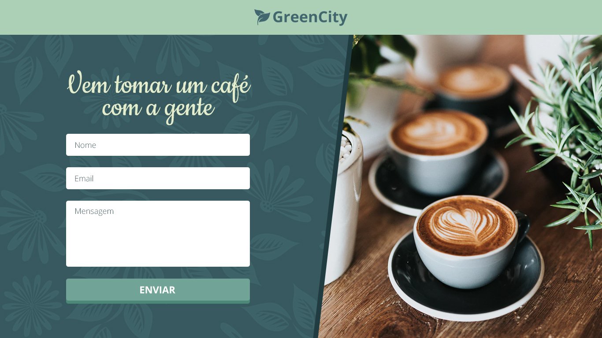

# Front-end @ Advance
This is a test for candidates aiming for a position at Advance as a Front-end developer.

## The task
We need you to implement the following interface using HTML, CSS and Javascript:

You have to implement:
* A responsive layout based on the design above
* Real-time validation on the contact form

You can view all the pages states and specifications on the `specs` folder and download the source psd* file [here](https://drive.google.com/file/d/19-fXPrpgDyJMkdhVyL2dpXcvV09jbHXN/view?usp=sharing).  All the fonts used in the layout are available on Google fonts. Refer to the specs file to find out which fonts to use.

There's no need to implement a back-end and post the form data to it. If you
really want to, bear in mind that you **won't get any extra points** for doing so.

\* *You don't need Photoshop to accomplish the task as all the image assets were exported and are available in the `assets` folder.*

## User story
This is a restaurant contact page, and the user should be able send messages to the 
owners using a simple contact form. The user must input their name, email address
and a message. All fields are required. The data must be validated using 
the following rules:

* Name: Should contain at least 2 words and 7+ characters
* Email: Should contain the `@` character preceded and followed by at least 1 character
* Message: Should contain at least 4 words and 20+ characters

The user must be warned in real-time about any input that doesn't match the above 
rules in a clear way, following the proposed design.

When all fields are valid, the user should be able to press the send button. Pressing
the button should trigger a success message, as shown in the design above.

## Using this repository
1. Fork this repo
2. Clone your fork
3. `npm install` it
4. Do your magic 🌈
5. Push your work
6. Deploy your project somewhere (we recommend using [surge.sh](https://surge.sh/))
7. Reply your invitation email with the links to your repository and your deployed project

*There's no need to send us a pull request with your code. All tests should be sent to us via email.*

This project has a minimal boilerplate set to help you start your work quickly. It uses [Parcel](https://parceljs.org/) to post process and budle your code. This means you can use ES6 modules, SCSS, PostCSS, etc. Feel free to customize it the way you want to, but you **won't get any extra points** for doing so. You are free to write your code the way you like to.

You can get more details on Parcel on its [documentation page](https://parceljs.org/getting_started.html).

## What we expect
Long story short, we expect clean, maintainable, legible and well organized code above everything else. However, we also expect you:

### HTML
* To make good use of semantic tags.
* To write HTML5 compliant code.
* To create a well structured DOM tree, without unnecessary elements.
* To make basic SEO optimizations.
* To optimize images used by the page.

### CSS
* **Not to** use CSS frameworks like Bootstrap, Foundation, Tailwind, etc. We don't use them for a myriad of reasons, so this is a no-go to us.
* To use a good CSS architecture.
* To use a good naming scheme.
* To use a CSS guideline (SMACSS, CSS guidelines, BEM, etc) when it makes sense to.
* To use modern CSS features like Flexbox, Grid, Custom properties, etc.
* To use CSS preprocessors **if and when** you feel it would be helpful to you. At Advance, although we use preprocessors like PostCSS on some projects, we tend to prefer using pure, modern CSS whenever possible. This means that you can use one if you'd like to, but **you won't get less or more points** by doing so. 

### Javascript
* To use vanilla Javascript (ES5, ES6/2015+) on most if not all of your code.
* To write your own validation logic. You can't use libraries to help you with this task.
* To have few or **no dependencies**.
* To put the browsers' native APIs to good use. Remember: you have Babel out of the box to transpile your code.
* To use an UI library or framework (like React, Vue, etc) if you feel that it makes sense to.

### Layout/Design
* To make a responsive layout based on the original design. We provided a desktop-first design above, and you should create a responsive layout based on it. We don't expect you to create new design elements to be shown exclusively on small and mobile devices, but rather an adapted layout that fits better on smaller devices that's based on the original design.
* To pay attention to the design's details. One of our UX Designers created it thinking about every little aspect of the layout, such as margins, paddings, fonts, colors, etc. You should analyze the image and deliver a page that resembles the original design as much as possible.

### Git
* To use git. 👀
* To use meaningful yet short commit messages.

## Any questions?
[Create an issue](https://github.com/penseadvance/front-end-test/issues/new) on this repository and we'll answer as quickly as possible.

Good luck! 🎉
